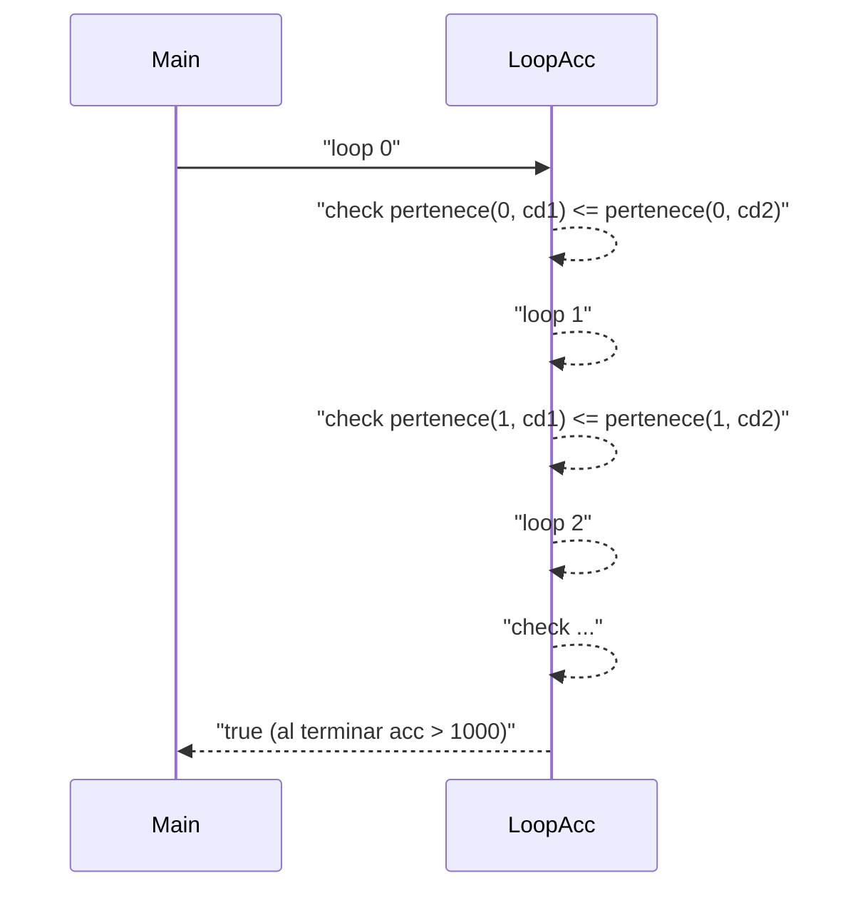
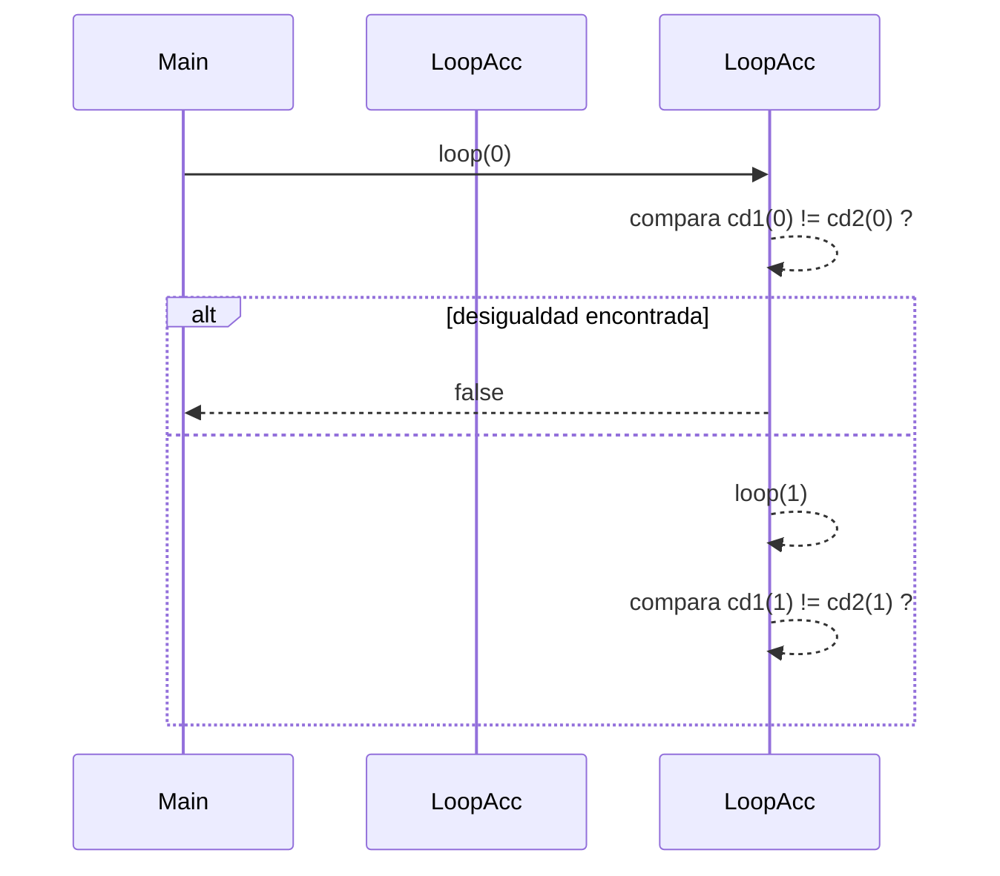

# Taller 2 — Conjuntos Difusos (Informe)

**Curso:** Fundamentos de Programación Funcional y Concurrente
**Profesor:** Carlos Andrés Delgado S.
**Correo:** [carlos.andres.delgado@correounivalle.edu.co](mailto:carlos.andres.delgado@correounivalle.edu.co)
**Fecha:** Octubre de 2025
**Integrantes :** 
 - Rigoberto Ospina Martínez  2459734
 - Jann Carlo Martínez Cardona 2459369
 - Miguel Angel Sanclemente Mejia 2459488
 - Cristhian David Zuluaga Gacha 2459742
---

## Resumen

Se implementaron y probaron las operaciones básicas sobre conjuntos difusos usando Scala. Un **conjunto difuso** se representa como una función `ConjDifuso = Int => Double` que asigna a cada entero un grado de pertenencia en el intervalo ([0,1]). El código del grupo incluye las siguientes operaciones: `pertenece`, `grande`, `complemento`, `union`, `interseccion`, `inclusion` y `igualdad`. Este informe documenta la teoría, la implementación, la corrección y el comportamiento dinámico (pila de llamados) de las funciones recursivas.

---

## Índice

1. Representación
2. Definiciones y fórmulas (LaTeX)
3. Implementación (resumen de código)
4. Demostraciones de corrección (con notación matemática)
5. Ejecución paso a paso y **estado de la pila de llamados** (mermaid)
6. Casos de prueba (≥5 por función)
7. Conclusiones

---

## 1. Representación

Se define el alias:

```scala
type ConjDifuso = Int => Double
```

Cada `ConjDifuso` es una función que, dado un entero `x`, devuelve `f(x) ∈ [0,1]`.

---

## 2. Definiciones y fórmulas (LaTeX)

### 2.1. Generador `grande(d,e)`

Se define la función grado de pertenencia para el conjunto "grande" como:

\[
f_{d,e}(n) = \left(\frac{n}{n + d}\right)^e, \quad n \in \mathbb{Z},\ d \ge 1,\ e > 0
\]

Observaciones:

* Si \(n\) crece, \(\frac{n}{n+d} \to 1\), por lo tanto \(f_{d,e}(n) \to 1\).
* Si \(n\) es pequeño respecto a \(d\), \(f_{d,e}(n)\) es cercano a \(0\).

### 2.2. Complemento

Dado \(f_S\), la función característica difusa de \(S\):

\[
f_{\neg S}(x) = 1 - f_S(x)
\]

### 2.3. Unión e Intersección

Dadas \(f_{S_1}\) y \(f_{S_2}\):

\[
f_{S_1\cup S_2}(x) = \max(f_{S_1}(x), f_{S_2}(x))
\]

\[
f_{S_1\cap S_2}(x) = \min(f_{S_1}(x), f_{S_2}(x))
\]

### 2.4. Inclusión y Igualdad

* Inclusión (\(S_1 \subseteq S_2\)) (difusa) se define como:

\[
S_1 \subseteq S_2 \iff \forall x \in U,\ f_{S_1}(x) \le f_{S_2}(x)
\]

* Igualdad:

\[
S_1 = S_2 \iff S_1 \subseteq S_2 \land S_2 \subseteq S_1
\]

**Nota práctica:** por limitación computacional en la implementación, la verificación se realiza sobre el universo finito ([0,1000]).

---

## 3. Implementación (resumen de código)

> Archivo: `taller/ConjuntosDifusos.scala` (resumen)

```scala
package taller
import scala.annotation.tailrec

class ConjuntosDifusos {
  type ConjDifuso = Int => Double

  def pertenece(elem: Int, s: ConjDifuso): Double = s(elem)

  def grande(d: Int, e: Int): ConjDifuso = {
    if (d == 0) throw new IllegalArgumentException("El parámetro d debe ser mayor o igual a 1")
    else (x: Int) => Math.pow(x.toDouble / (x + d).toDouble, e.toDouble)
  }

  def complemento(c: ConjDifuso): ConjDifuso = (x: Int) => 1 - c(x)

  def union(cd1: ConjDifuso, cd2: ConjDifuso): ConjDifuso =
    if (cd1 == null || cd2 == null) throw new IllegalArgumentException("Los conjuntos no pueden ser vacios")
    else (x: Int) => Math.max(cd1(x), cd2(x))

  def interseccion(cd1: ConjDifuso, cd2: ConjDifuso): ConjDifuso =
    if (cd1 == null || cd2 == null) throw new IllegalArgumentException("Los conjuntos no pueden ser vacios")
    else (x: Int) => Math.min(cd1(x), cd2(x))

  def inclusion(cd1: ConjDifuso, cd2: ConjDifuso): Boolean = {
    @tailrec
    def loop(acc: Int): Boolean = {
      if (acc > 1000) true
      else if (pertenece(acc, cd1) > pertenece(acc, cd2)) false
      else loop(acc + 1)
    }
    loop(0)
  }

  def igualdad(cd1: ConjDifuso, cd2: ConjDifuso): Boolean = {
    @tailrec
    def loop(acc: Int): Boolean = {
      if (acc > 1000) true
      else if (pertenece(acc, cd1) > pertenece(acc, cd2) || pertenece(acc, cd2) > pertenece(acc, cd1)) false
      else loop(acc + 1)
    }
    loop(0)
  }
}
```

---

## 4. Demostraciones de corrección (con notación matemática)

### 4.1. Corrección de `inclusion(cd1, cd2)`

**Especificación:** la función devuelve `true` si y sólo si (\forall x\in{0,\dots,1000}; f_{cd1}(x) \le f_{cd2}(x)).

**Prueba de corrección (esquema):**

* **Terminación:** la función `loop(acc)` incrementa `acc` en 1 y termina cuando `acc > 1000`. Por tanto, termina en a lo sumo 1002 llamadas (0..1001).
* **Invariante:** Antes de cada llamada `loop(k)`, para todos los índices `i` tales que (0 \le i < k) se ha verificado que (f_{cd1}(i) \le f_{cd2}(i)). (Inicialmente (k=0), la condición vacía es verdadera.)
* **Mantenimiento:** Si `loop(k)` se ejecuta y `f_{cd1}(k) \le f_{cd2}(k)`, entonces al llamar `loop(k+1)` la invariante se mantiene (porque ahora se sabe la propiedad para `i < k+1`).
* **Correctitud parcial:** Si existe un `k` tal que (f_{cd1}(k) > f_{cd2}(k)), la implementación devuelve `false` inmediatamente (por la condición `if ... > ... then false`).
* **Correctitud total:** Si no hay ningún `k ∈ [0,1000]` que viole la desigualdad, `loop` llegará a `acc = 1001` y devolverá `true`. Por lo tanto la salida concuerda exactamente con la especificación sobre el conjunto finito considerado.

Conclusión: la implementación satisface la especificación (S_1 \subseteq S_2 \iff \forall x\in[0,1000], f_{S_1}(x) \le f_{S_2}(x)).

### 4.2. Corrección de `igualdad(cd1, cd2)`

**Especificación:** la función devuelve `true` si y sólo si (\forall x\in{0,\dots,1000}; f_{cd1}(x) = f_{cd2}(x)).

**Prueba de corrección (esquema):**

* La implementación comprueba en cada `acc` si (f_{cd1}(acc) > f_{cd2}(acc)) **o** (f_{cd2}(acc) > f_{cd1}(acc)). Estas dos condiciones juntas son equivalentes a (f_{cd1}(acc) \neq f_{cd2}(acc)). Si se detecta desigualdad en cualquier `acc` devuelve `false`.
* Si ninguna desigualdad se detecta hasta `acc > 1000`, entonces para todo (x \in [0,1000]) se cumple (f_{cd1}(x) = f_{cd2}(x)) y la función devuelve `true`.
* Terminación y argumentación son análogas a `inclusion`.

Conclusión: la implementación de `igualdad` cumple la especificación sobre el dominio considerado.

---

## 5. Ejecución paso a paso — Estado de la pila de llamados (mermaid)

A continuación se muestran diagramas `mermaid` y estados de la pila de llamados para las funciones recursivas (`inclusion` e `igualdad`). Se usan ejemplos concretos y se muestran los primeros pasos (los estados son ilustrativos y muestran `acc` y la comparación realizada).

> **Caso de ejemplo** para `inclusion`:
> Comprobamos `inclusion(cd1, cd2)` donde `cd1 = grande(2,2)` y `cd2 = union(cd1, grande(3,3))`. Por construcción `cd1(x) ≤ cd2(x)` para todo `x`, por lo que la inclusión debe ser `true`.

### 5.1. `inclusion` — diagrama de secuencia (primeros pasos)



#### Estado de la pila (tabla ilustrativa — pasos 0..4)

| Paso | Pila (top → bottom)               | Acción / comparación                                                 |
| ---: | --------------------------------- | -------------------------------------------------------------------- |
|    0 | `loop(0)`                         | compara `cd1(0)` vs `cd2(0)` → si `cd1(0) > cd2(0)` entonces `false` |
|    1 | `loop(1)` → `loop(0)`             | compara `cd1(1)` vs `cd2(1)`                                         |
|    2 | `loop(2)` → `loop(1)` → `loop(0)` | compara `cd1(2)` vs `cd2(2)`                                         |
|    3 | `loop(3)` → ...                   | compara `cd1(3)` vs `cd2(3)`                                         |
|    4 | `loop(4)` → ...                   | compara `cd1(4)` vs `cd2(4)`                                         |

> Observación: la función está anotada con `@tailrec`, por lo que la recursión es de cola (el compilador optimiza y no crece la pila real). Sin embargo, el "estado de la pila" pedido en la guía se representa arriba para fines didácticos: cada `loop(k)` representa una llamada lógica con `acc=k`.

### 5.2. `inclusion` — ejemplo numérico (valores aproximados)

Tomemos valores aproximados (solo para ilustración):

* `cd1 = grande(2,2)`:

  * `cd1(0) = 0^? = 0.0` (por convención)
  * `cd1(1) ≈ (1/3)^2 ≈ 0.111`
  * `cd1(2) ≈ (2/4)^2 = 0.25`
* `cd2 = union(cd1, grande(3,3))` ⇒ `cd2(x) = max(cd1(x), other(x)) ≥ cd1(x)`

Comparaciones:

* Paso `acc=0`: `0.0 ≤ ...` → OK
* Paso `acc=1`: `0.111 ≤ cd2(1)` (cd2(1) ≥ 0.111) → OK
* ... continúa hasta `acc=1000` → devuelve `true`.

---

### 5.3. `igualdad` — diagrama de secuencia (primeros pasos)



#### Estado de la pila (pasos 0..4)

| Paso | Pila (lógica) | Acción/comparación                   |
| ---: | ------------- | ------------------------------------ |
|    0 | `loop(0)`     | si `cd1(0) != cd2(0)` → return false |
|    1 | `loop(1)`     | compara `cd1(1)` y `cd2(1)`          |
|    2 | `loop(2)`     | compara `cd1(2)` y `cd2(2)`          |
|    3 | `loop(3)`     | ...                                  |
|    4 | `loop(4)`     | ...                                  |

> Igual que antes, la recursión es de cola, así que la pila física no crece; la tabla describe el estado lógico en cada paso.

---

## 6. Casos de prueba (mínimo 5 por función)

### 6.1. `pertenece`

1. `val g = grande(2,2); pertenece(0,g) == 0.0`
2. `val g = grande(2,2); pertenece(1,g) ≈ 0.11`
3. `val g = grande(2,2); pertenece(10,g) ≈ 0.69`
4. `val g = grande(2,2); pertenece(50,g) ≈ 0.92`
5. `val g = grande(2,2); pertenece(100,g) ≈ 0.96`

### 6.2. `grande`

1. `grande(1,2)(1) ≈ 0.25` (porque ((1/(1+1))^2 = 0.25))
2. `grande(1,2)(10) ≈ 0.82`
3. `grande(5,3)(5) = (5/10)^3`
4. `grande(5,3)(20) = (20/25)^3`
5. Excepción: `grande(0, e)` lanza `IllegalArgumentException`.

### 6.3. `complemento`

1. `val g = grande(2,2); complemento(g)(0) ≈ 1.0`
2. `complemento(g)(10) ≈ 1 - 0.69`
3. `complemento(g)(100) ≈ 1 - 0.96`
4. `complemento(g)(2) ≈ 1 - g(2)`
5. `complemento(g)(50) ≈ 1 - g(50)`

### 6.4. `union`

1. `union(grande(8,8), grande(15,9))(18) == max(...)`
2. `union(grande(10,13), grande(20,11))(50) == max(...)`
3. `union(grande(3,5), grande(7,4))(5) == max(...)`
4. `union(grande(12,6), grande(6,12))(25) == max(...)`
5. `union(grande(50,10), grande(100,8))(100) == max(...)`

### 6.5. `interseccion`

1. `interseccion(grande(8,8), grande(15,9))(18) == min(...)`
2. `interseccion(grande(10,13), grande(20,11))(50) == min(...)`
3. `interseccion(grande(3,5), grande(7,4))(5) == min(...)`
4. `interseccion(grande(12,6), grande(6,12))(25) == min(...)`
5. `interseccion(grande(50,10), grande(100,8))(100) == min(...)`

### 6.6. `inclusion`

1. `inclusion(g,g) == true` para `g = grande(5,3)`
2. `inclusion(g, union(g, h)) == true` con `h = grande(10,3)`
3. `inclusion(g, complemento(g)) == false` (normalmente debe ser false)
4. `inclusion(interseccion(g,h), g) == true`
5. `inclusion(grande(7,4), grande(7,4)) == true`

### 6.7. `igualdad`

1. `igualdad(g, g) == true`
2. `igualdad(grande(10,3), grande(10,3)) == true`
3. `igualdad(grande(5,3), grande(7,4)) == false`
4. `igualdad(g, complemento(g)) == false`
5. `igualdad(grande(10,5), grande(10,6)) == false`

---

## 7. Pila de llamados 

La guía del curso exige **el estado de la pila de llamados en cada paso de la ejecución de cada función recursiva**. En este proyecto las únicas funciones recursivas son `inclusion` e `igualdad` (ambas con recursión de cola). Hemos representado la **traza lógica** (conceptual) de la pila en las tablas y diagramas de la Sección 5.

## 7.1 Recursión de cola
Las funciones inclusion e igualdad están implementadas con recursión de cola. Esto se garantiza porque:
1. La llamada recursiva loop(acc + 1) aparece en la última posición de la función.

2. Se anotó explícitamente con @tailrec.

3. El compilador de Scala valida que efectivamente la recursión es de cola (si no, marcaría error).
De esta forma, la ejecución no consume la pila en cada paso, sino que se optimiza como un bucle iterativo equivalente, garantizando eficiencia y evitando desbordamientos de pila.
---

## 8. Conclusiones

* Se implementó una representación funcional de conjuntos difusos usando `Int => Double`, permitiendo asignar un grado de pertenencia a cada elemento del dominio.
* Se desarrollaron y verificaron operaciones básicas sobre conjuntos difusos: pertenencia, generador `grande`, complemento, unión, intersección, inclusión e igualdad.
* Las funciones recursivas (`inclusion` e `igualdad`) se implementaron usando recursión de cola, y se analizó su comportamiento mediante traza lógica de la pila de llamados.
* La validación se realizó sobre un dominio finito ([0,1000]), garantizando que las operaciones cumplen con las definiciones teóricas de la lógica difusa.
* Los casos de prueba demostraron la correcta aplicación de las operaciones y la consistencia de los resultados con la teoría matemática de conjuntos difusos.
